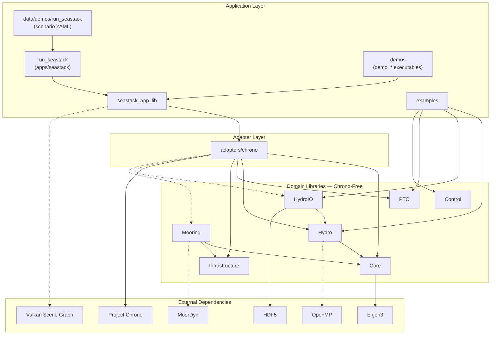
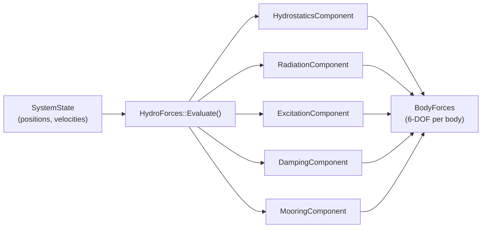
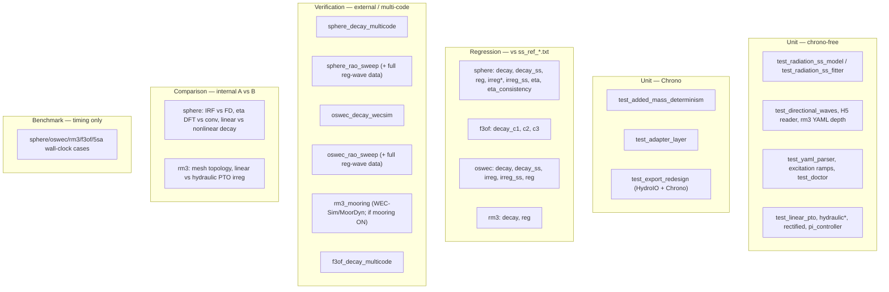
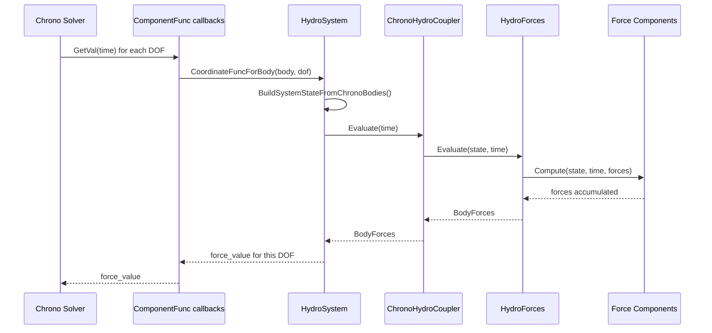
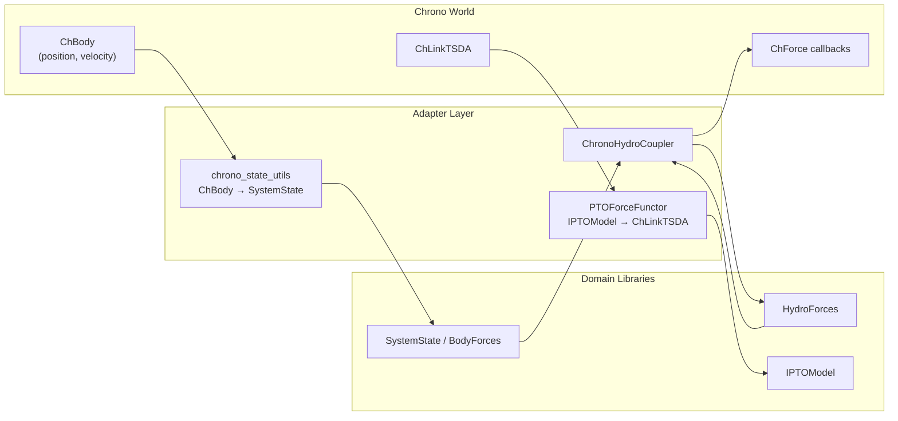
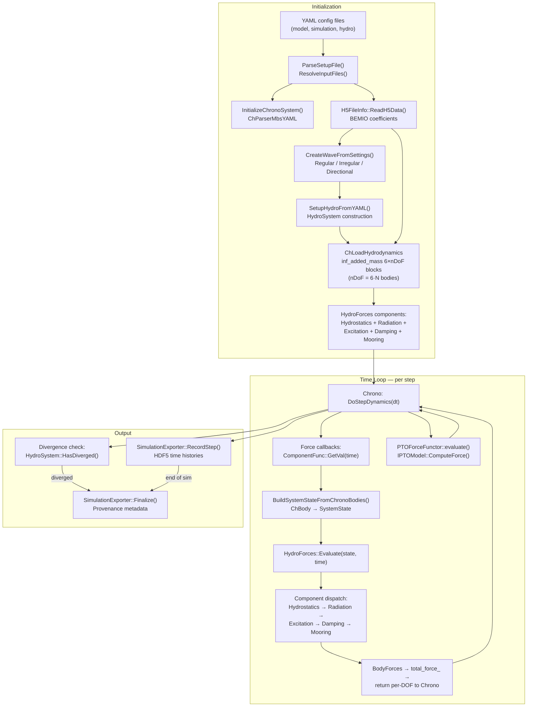
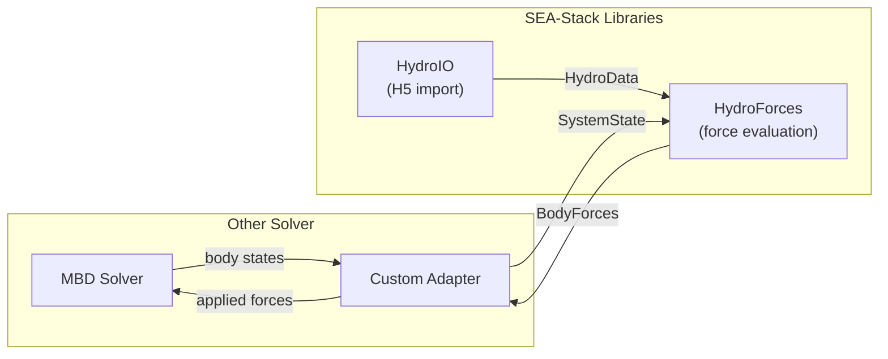
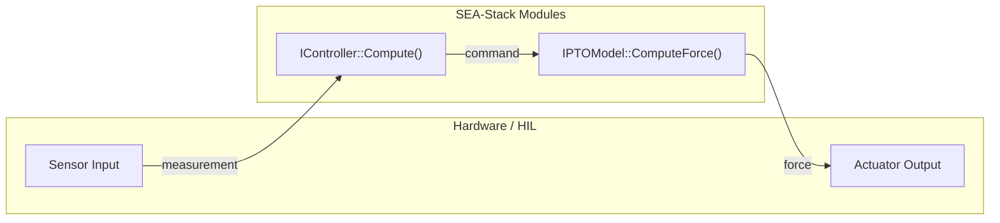

# SEA-Stack: Overview

**Version:** v1.0.0-beta.2
**Date:** March 2026

---

## 1. Executive Summary

SEA-Stack is a modular C++17 simulation platform for offshore energy systems. It provides libraries for hydrodynamics, mooring, power take-off (PTO), and control, with Project Chrono as the multibody dynamics engine.

Its core architectural feature is the separation of domain physics from the solver engine. The hydrodynamics, PTO, and control libraries are Chrono-free, exposing Eigen-based interfaces that can run standalone or couple to other solvers via a thin adapter layer.

This architecture is designed to enable multi-fidelity modelling: the same system models and domain logic can be reused across different simulation backends (e.g. potential flow, CFD, SPH). While v1.0.0-beta.2 uses linear potential-flow hydrodynamics, the structure supports higher-fidelity methods without rewriting the system model.

The aim is to support both rapid design iteration and progressive confidence-building. Early-stage concepts need fast, flexible simulation to explore alternatives, while later stages need a path to higher-fidelity methods before costly prototype deployment and sea trials. The same solver-independent interfaces also provide a basis for future hardware-in-the-loop workflows.

SEA-Stack v1.0.0-beta.2 includes:

- Linear potential-flow hydrodynamics with optional nonlinear hydrostatics
- BEMIO-formatted HDF5 import for BEM-derived hydrodynamic coefficients
- Dense infinite-frequency added mass from BEM included in the Chrono mass
  matrix via `ChLoadHydrodynamics` (no lagged-force / prior-step-acceleration
  workaround)
- Radiation via RIRF convolution or state-space models
- Regular, irregular, and directional wave excitation
- Mooring via MoorDyn coupling
- Linear and hydraulic PTO models
- YAML-driven simulation and HDF5 results export
- Optional 3D visualisation and distributable Windows and macOS packages

---

## 2. Project Context and Motivation

Offshore energy systems are difficult to model. Different stages of development call for different levels of model fidelity, from fast potential-flow models to higher-fidelity methods.

It is not always clear which approach is most useful at a given stage, or which physical effects are worth including. A useful simulation platform therefore needs optionality: it should support rapid iteration, comparison between modelling approaches, and a path to higher-fidelity methods where needed.

Many existing ocean engineering tools are well suited to established analysis workflows. They are often less flexible for new technology development. New concepts need tools that are easier to extend, adapt, and connect to different modelling approaches.

This has implications for software design. In many tools, hydrodynamics, structural dynamics, mooring, and control are tightly coupled. That can work for fixed workflows. It also makes it harder to swap solvers, add new physics, or connect to external systems such as hardware-in-the-loop setups.

SEA-Stack addresses this by separating domain physics from the simulation engine. It uses clear module boundaries and explicit interfaces. This supports extension, experimentation, and long-term evolution of the platform.

SEA-Stack grew from the earlier HydroChrono project, which explored the use of Project Chrono for offshore hydrodynamics, including dense added-mass coupling. The current codebase extends that work into a broader modular platform. The project is jointly copyrighted by Simocean Ltd. and NLR and released under the MIT license.

The project is developed openly and is intended to be accessible to engineers and researchers who are not C++ specialists.

---

## 3. Scope of SEA-Stack v1.0.0-beta.2

### Supported now

- Linear potential-flow hydrodynamics (6-DOF per body, multi-body)
- Linear or nonlinear hydrostatics (mesh-based instantaneous submerged volume)
- BEMIO-formatted HDF5 coefficient import
- Regular, irregular (JONSWAP/PM), bimodal, and multi-directional wave fields
- Precomputed elevation time-series import (eta-table) for IRF excitation
- RIRF convolution and state-space radiation models
- Excitation force via frequency-domain transfer functions or IRF convolution
  with elevation history
- Linear and quadratic damping per body per DOF
- MoorDyn v2 mooring coupling (optional)
- Linear spring-damper PTO
- Rectified hydraulic PTO (check-valve bridge, HP/LP accumulators,
  motor-generator dynamics, optional controller)
- Scalar control interface
- Project Chrono multibody dynamics integration
- Dense BEM infinite-frequency added mass in the solver mass matrix via
  `ChLoadHydrodynamics` (direct assembly, not a lagged applied force)
- YAML-based simulation configuration
- HDF5 simulation export
- VSG 3D visualization with water surface rendering (optional)
- Self-contained Windows and macOS packaging via CPack

### Options for extensibility

- Custom wave models (user implements `WaveBase`)
- Custom force components (user implements `IHydroForceComponent`)
- Custom PTO models (user implements `IPTOModel`)
- Custom controllers (user implements `IController`)
- Alternative solver backends (user writes adapter analogous to `ChronoHydroCoupler`)
- Multi-DOF PTO and state-feedback control (requires interface extension)

### Future direction

- Nonlinear Froude-Krylov and viscous drag forces
- Higher-fidelity mooring models
- More complex PTO and control subsystems
- Python bindings
- CI/CD pipeline

---

## 4. Design Principles

1. **Solver independence.**  Domain physics libraries have zero dependency on
   any simulation engine. Chrono is accessed only through the adapter layer.

2. **Explicit interfaces.**  Each module exposes a small, well-typed interface.
   Data flows through `SystemState` and `BodyForces` -- plain Eigen-based
   structs that any solver can construct.

3. **Minimal dependencies.**  Each library declares only the dependencies it
   actually needs. PTO and Control depend on nothing but the C++ standard
   library.

4. **Clarity over cleverness.**  The codebase prioritizes readability for
   engineers over C++ abstraction. Template metaprogramming is avoided.
   Physical quantities carry documented units.

5. **Testability.**  Chrono-free libraries can be tested without a simulation
   engine. Unit tests carry the label `chrono-free` and run in milliseconds.

---

## 5. Architecture

SEA-Stack has three layers.

1. **Domain libraries** (`libs/`). They implement the offshore physics: hydrodynamics, mooring, PTO, control, and shared infrastructure. They define the core data types (`SystemState`, `BodyForces`) and force-component interfaces.

2. **Adapter** (`adapters/chrono/`). It maps Project Chrono onto those types. Domain code under `libs/` does not include Chrono; this layer registers `ChLoadHydrodynamics` so the dense BEM infinite-frequency added-mass matrix is assembled into the solver’s mass system directly—not applied as a lagged force from the prior step’s acceleration. Radiation, excitation, and other hydro loads stay in `HydroForces` / `ChForce` (Appendix F.3). Programs under `apps/` and `demos/` may still include Chrono headers for bodies, constraints, solvers, or FEA beyond what the adapter abstracts (for example `demos/trimaran/demo_trimaran_fea.cpp`).

3. **Applications** (`apps/`, `demos/`, `examples/`). The primary YAML-driven executable is **`run_seastack`** (`apps/seastack`). Programs under **`demos/`** (the **`demo_*`** executables) use the same underlying application stack; many assemble or extend the Chrono model graph directly while using SEA-Stack hydro through the adapter. **`examples/`** are small standalone programs that use selected domain libraries only, without Chrono.

The key idea is simple: **domain physics does not depend on the solver.**

Hydrodynamics can run behind a different engine with a new adapter, if needed. PTO and control modules can run without any multibody solver.

The figure below shows **high-level dependencies between components** (what each part relies on). Solid arrows are required dependencies; dashed arrows are optional. The arrows are **not** meant to capture every code-level include or runtime interaction. No dependency runs from the domain libraries to Chrono — it is isolated behind the adapter. Scenario YAML under `data/demos/run_seastack/` is read by **`run_seastack`**.




**Repository map:**

- **Domain (`libs/`).** Core offshore physics and shared infrastructure; no Chrono.
- **Adapter (`adapters/chrono/`).** Only layer that couples **domain** physics (`libs/`) to Project Chrono.
- **Main app (`apps/seastack/`).** Provides the `run_seastack` executable for YAML-driven simulations.
- **Scenario data (`data/demos/run_seastack/`).** Example YAML inputs for `run_seastack`.
- **Demos (`demos/`).** Additional C++ `demo_*` programs on the same application stack as `run_seastack`; demo code may use Chrono types and modules directly (e.g. FEA, links) where the case needs them.
- **Examples (`examples/`).** Small programs that use selected domain libraries only—no Chrono path.

In practice: **`examples/`** (and chrono-free tests) let you work with domain physics without Chrono. **YAML-driven** runs through **`run_seastack`** configure full multibody simulations without writing C++ against Chrono. **C++ demos** remain Chrono-backed when the scenario requires it—they combine the adapter stack with direct Chrono use where the model goes beyond what YAML alone expresses.

### 5.2 How It Works

At each time step, the system computes forces from the current state of the bodies.

The inputs are positions and velocities for each body (`SystemState`), and the current time. The output is a set of forces and moments on each body (`BodyForces`).

Inside the domain layer, these forces are built by combining independent components. Each component (hydrostatics, radiation, excitation, damping, mooring) adds its contribution to the total. The components do not depend on Chrono.




`HydroForces` does not choose which physics are active. It is constructed with a fixed list of `IHydroForceComponent` instances, and `Evaluate()` runs them in order.

The component list is defined earlier by `HydroModelBuilder::Build()`, based on the simulation setup (hydrostatics model, radiation method, wave type, damping, optional components such as mooring). `HydroModel` owns the resulting `HydroForces` and forwards `Evaluate()` calls to it.

The example below shows how the component set is chosen at build time.

```cpp
using namespace seastack::hydro;

// Load BEM coefficients
HydroData data = seastack::hydro_io::H5FileInfo("device.h5", 1).ReadH5Data();

// Simple irregular sea state
SeaStateDefinition sea_state;
sea_state.type = "irregular";

SeaStatePartition partition;
partition.spectrum.Hs = 2.0;  // [m]
partition.spectrum.Tp = 8.0;  // [s]
sea_state.partitions.push_back(partition);

// Build model
HydroModel model = HydroModelBuilder()
    .FromHydroData(std::move(data))
    .WithSeaState(sea_state)
    .EnableHydrostatics()
    .EnableRadiation()
    .EnableExcitation()
    .Build();

// In the time loop:
SystemState state = /* fill from your solver */;
BodyForces forces = model.Evaluate(state, time);
```

A different setup—still water, different radiation method, added damping, or extra components such as mooring—produces a different force model without changing how forces are evaluated.

When running inside Chrono, the solver calls this same force evaluation at each substep. The adapter builds a `SystemState` from `ChBody` data, runs the domain calculation, then maps the resulting forces back into the form Chrono expects.

The boundary is explicit: `ChronoHydroCoupler::Evaluate()` sits between Chrono and the domain code. Above it are Chrono types and callbacks. Below it are Eigen-based types and solver-independent models.

**Added mass** is handled separately from this force pipeline.

The infinite-frequency added-mass matrix from the BEM data is passed directly into Chrono, where it is added to the system mass matrix. This includes cross-body coupling when present in the data.

Chrono v10 supports this dense added-mass coupling directly (via `ChLoadHydrodynamics`). Other solvers would need equivalent support, or a different approach, to reproduce the same behaviour.

PTO forces follow the same separation idea but enter Chrono differently: `PTOForceFunctor` connects `IPTOModel::ComputeForce()` to Chrono’s spring–damper links. The PTO model stays in the domain library; Chrono provides the mechanism.

YAML-driven runs load the model, read BEM data, assemble the components, and step the simulation. Full initialization and runtime flow are described in Appendix F.3 (especially F.3.4).

### 5.3 What This Enables

**Hydro without Chrono.** `examples/standalone_hydro/main.cpp` links `SEAStack::Hydro`, `SEAStack::HydroIO`, and `SEAStack::Infra`. It reads HDF5, builds components, fills `SystemState`, and calls `HydroForces::Evaluate()` in a loop. No Chrono headers are required.

**PTO and control without heavy stacks.** `examples/standalone_controller/main.cpp` links only `SEAStack::PTO` and `SEAStack::Control`. It uses simple scalar interfaces (`double` in, `double` out) with no Eigen, HDF5, or multibody solver.

**Extensible physics.** New components can be added without modifying existing code, and the same interfaces can support alternative models as the platform evolves.

**Path to multi-fidelity modelling.** The domain interfaces are solver-independent. In principle, the same system model can be coupled to different backends (e.g. CFD, SPH) through new adapters.

**Path to HIL and deployment.** Lightweight modules such as PTO and control can run outside a simulation engine, enabling hardware-in-the-loop workflows and embedded use.


For **module targets**, **core type definitions**, and **supplementary diagrams** (including full Chrono initialization and runtime flow), see **Appendix F**.

---

## 6. Build, Test, and Packaging Overview

### 6.1 Build configuration

CMake (minimum 3.18). Main options:

| Flag | Default | Purpose |
|------|---------|---------|
| `SEASTACK_ENABLE_CHRONO` | ON | Chrono adapter and apps |
| `SEASTACK_ENABLE_HYDRO_IO` | ON | HDF5 import/export |
| `SEASTACK_ENABLE_MOORING` | OFF | MoorDyn |
| `SEASTACK_ENABLE_VSG` | OFF | VSG visualization |
| `SEASTACK_ENABLE_TESTS` | ON | Test executables |
| `SEASTACK_ENABLE_DEMOS` | OFF | Demos |
| `SEASTACK_ENABLE_APPS` | ON | Apps (`run_seastack`) |

`SEASTACK_ENABLE_CHRONO=OFF` builds the domain libraries only (no Chrono).

### 6.2 Tests

CTest groups work by label: `unit`, `regression`, `verification`, `comparison`, `benchmark`. Quick start and runners: [`tests/README.md`](tests/README.md). Full naming matrices and raw `ctest`: [`tests/TEST_SUITES_REFERENCE.md`](tests/TEST_SUITES_REFERENCE.md). Suite mechanics and quality context: **Appendix C**.



- **Unit** — Library checks; most are Chrono-free and fast.
- **Regression** — Simulations vs frozen references (Python, L2/L∞).
- **Verification** — External or multi-code baselines under `data/verification/`.
- **Comparison** — Two SEA-Stack builds compared in Python.
- **Benchmark** — Wall-clock JSON; not a correctness gate.

### 6.3 Package structure

CPack emits a Windows ZIP (`bin/`, `data/chrono/`, `demos/`, `tests/`, license notices). An SDK install adds headers and CMake config for downstream use.

---

## 7. Quality, Current Limits, and Next Steps

### 7.1 Quality and validation

Development follows the Google C++ style guide, Effective Modern C++ idioms, and the spirit of *Writing Scientific Software* (units, frames, traceability). Implementations cite sources where it matters (e.g. Cummins radiation; JONSWAP / Pierson–Moskowitz spectra; Faltinsen hydrostatics).

**Tests:** unit (fast, mostly Chrono-free), regression (vs frozen references), verification (cross-code). The shipped package includes runners so installs can be checked locally. Expanded standards notes, error-handling policy, and test mechanics: **Appendix C**.

### 7.2 Current limitations

**Beta scope.** Radiation and excitation are linear potential-flow about equilibrium. Nonlinear hydrostatics (mesh buoyancy) exists; nonlinear Froude–Krylov and viscous drag do not yet. `IPTOModel` / `IController` are scalar; multi-DOF PTO and state-feedback would need interface work. Tests use custom macros (`TEST_ASSERT`, `TEST_NEAR`), not Google Test/Catch2.

**Architecture.** YAML wave construction lives in the Chrono adapter (`CreateWaveFromSettings`); moving it into `libs/hydro` would strengthen standalone use. Core headers live under `libs/core/` but use `namespace seastack::hydro` for some types—a naming cleanup for later.

**Distribution.** CPack targets Windows ZIP today. `SEASTACK_ENABLE_CHRONO=OFF` builds, but a Chrono-free installable SDK has not been fully validated.

### 7.3 Future direction

Nonlinear hydrodynamics (Froude–Krylov, viscous drag); multi-DOF PTO and richer control; pluggable mooring beyond MoorDyn; Python bindings; CI/CD on major OSes; Linux/macOS packaging; performance work (e.g. wave evaluation, radiation parallelism).

---

## 8. Conclusion

SEA-Stack v1.0.0-beta.2 separates domain physics from the dynamics engine: hydro as a reusable library, PTO/control as light modules, Chrono as the current backend with a thin adapter. That layout supports standalone use, alternative solvers in principle, and future fidelity options.

The beta is buildable, tested, and packagable on Windows, with architecture reviewed against this design. Next focus: documentation, broader testing, community use, and movement toward a stable v1.0.

---

## Appendix A: Technology Choices and Rationale

### A.1 Why Project Chrono

Project Chrono is an open-source multibody dynamics engine with a strong
track record across a wide range of engineering domains: ground and
off-road vehicles, robotics, renewable energy systems (including wind and
wave), and space applications. It is widely used in research and
innovation for its:

- Formulation in body-level (Cartesian) coordinates with constraint
  equations, which allows a wide range of system topologies—closed loops,
  flexible bodies, arbitrary mechanisms—to be modeled in a unified way
  without hand-derived minimal coordinates
- Robust time integration (HHT-alpha, Newmark, etc.)
- Contact and constraint handling
- FEA capabilities for flexible bodies
- Active development and community
- BSD-3.0 license

SEA-Stack uses Chrono as the dynamics engine while keeping all offshore
domain logic in its own libraries. This means SEA-Stack benefits from
Chrono's solver quality and maturity without being architecturally locked
to it. Domain libraries do not import Chrono; coupling them to the solver
is centralized in `adapters/chrono/`. Application and demo code may still
include Chrono headers when building or extending the multibody model.

### A.2 Why C++

- **Performance.** Radiation convolution, wave superposition, and time
  integration are computationally intensive. C++ provides the control over
  memory layout, inlining, and vectorization needed for these hot paths.

- **Interoperability.** Chrono is C++, and MoorDyn exposes a C API. A native
  C++ codebase integrates with both directly without adding wrapper layers or
  FFI complexity to the core stack.

  - Foreign function interfaces (FFIs) couple different programming
    languages across a shared boundary, which can add wrapper code, data
    conversion, build complexity, and harder debugging.

- **Ecosystem and interactive visualization.** The same language choice that
  fits Chrono and MoorDyn also fits optional GPU-backed 3D visualization
  (Vulkan Scene Graph): efficient scene updates, tension-based coloring of
  mooring lines, and responsive inspection of multibody + wave environments
  are far more practical with native C++/Vulkan stacks than with thin
  wrappers around interpreted runtimes.

- **Architecture as well as numerics.** SEA-Stack is not just a set of
  numerical kernels; it is a modular simulation platform with reusable
  libraries, explicit interfaces, solver adapters, and application-layer
  orchestration. Modern C++ is well suited to that combination.

- **Clear interfaces and boundaries.** Contracts such as
  `IHydroForceComponent`, `IPTOModel`, and `IController`, together with
  separate CMake targets, support clear module boundaries and separation
  between domain logic and solver-specific code.

- **Packaging and reuse.** Exported CMake packages allow downstream projects
  to link selected SEA-Stack libraries without pulling in the full
  application stack.

- **Practical modern features.** C++17 provides useful standard-library
  features such as `std::optional` and `std::filesystem` while remaining
  accessible to engineers who are not C++ specialists.

- **Why not Fortran?** Fortran remains strong for focused numerical kernels,
  but SEA-Stack's requirements extend beyond raw numerics to modular,
  extensible architecture, external library integration, and reusable
  packaged components. The choice of C++ reflects those broader
  software-engineering needs.

### A.3 Why a Native Hydrodynamics Module

Rather than wrapping an external hydrodynamics library, SEA-Stack implements
its own hydrodynamic force engine. This provides:

- **No external runtime dependency** for force evaluation (HDF5 is needed
  only for coefficient import, not during time-stepping)
- **Chrono-free operation** -- the hydro library is designed to operate
  independently of the multibody solver layer
- **Extensibility** -- new force components and model variants can be added
  within SEA-Stack without modifying third-party source code
- **Traceability** -- implemented formulations can be linked directly to
  their source publications and validated in a transparent way

This choice is motivated not only by software architecture, but also by
modelling strategy. For novel ocean technologies such as wave energy
converters, the most effective numerical workflow is often not fixed in
advance. Different stages of design may call for different levels of
hydrodynamic fidelity, and it is not always obvious which modelling features
are worth introducing, when they should be used, or how much additional
complexity they justify.

SEA-Stack is therefore intended to support a **multi-fidelity modelling**
approach. By developing the hydrodynamics module natively and extending it
over time, the project can do more than add new simulation features in
isolation. It can provide a framework for comparing those features against
higher-fidelity approaches such as CFD or SPH, and for assessing their
practical value within a wider WEC design workflow.

The aim is not only to improve individual numerical methods, but also to
develop better numerical modelling strategies: to understand which
hydrodynamic capabilities materially improve decision-making, when they are
worth deploying, and how different fidelity levels should be combined across
a wave energy development campaign.

The current implementation follows standard linear potential-flow theory:

- **Radiation:** Cummins (1962) impulse-response convolution, or state-space
  approximation
- **Excitation:** Convolution of wave elevation with excitation IRF, or
  frequency-domain transfer functions
- **Hydrostatics:** Linear restoring from BEM stiffness matrices, or
  nonlinear buoyancy from instantaneous submerged volume
- **Spectra:** Pierson-Moskowitz (1964), JONSWAP (Hasselmann et al., 1973)

---

## Appendix B: AI-Assisted Development

Assistants (and human reviewers) do best when tasks are localized, contracts are
explicit, and results are easy to verify. SEA-Stack is organized so that
generated or refactored code tends to touch small surfaces, compile against
clear interfaces, and land in a project where CTest plus plots and reports
give fast, reviewable feedback. The points below are architectural strengths; read
together, they describe *why* the codebase is a practical fit for AI-assisted
implementation and review—not only for hand-written development.

- **Small, solver-agnostic interfaces** limit how much context a model must hold:
  `IHydroForceComponent` (`Type()`, `Compute()`), `IPTOModel` and `IController`
  with one main method each. New physics or control typically implements a type
  without spurious edits across the tree.

- **Explicit adapter boundary** keeps solver details out of domain prompts:
  Chrono-specific code lives in `adapters/chrono/`, so “add a force” or “change
  PTO” rarely requires reasoning about the multibody API.

- **Concrete data flow** reduces silent mistakes: `SystemState` and `BodyForces`
  use documented SI units and avoid hidden globals between modules, so generated
  glue code is easier to check against the contract.

- **Standalone examples** (`examples/standalone_hydro/`,
  `examples/standalone_controller/`) run **without Chrono**, giving a cheap way
  to validate library-level changes in isolation.

- **Fast feedback.** Many unit tests are labeled `chrono-free` and finish in
  milliseconds, which suits tight edit–test loops with an assistant.

- **Layered tests and reviewable artifacts.** CTest spans unit, regression,
  verification, comparison, benchmark, and other labeled suites. Regression,
  verification, and comparison additionally emit comparison plots (e.g. under
  the build results tree) and aggregated Markdown reports; with Pandoc and
  LaTeX available, those reports can become PDFs—one place to skim figures
  and pass/fail context after a change. That mix of numeric checks and visual
  diff-style plots helps reviewers and assistants validate non-trivial
  edits without trusting stdout alone. See [`tests/README.md`](tests/README.md)
  and [`tests/REPORTING_AND_PLOTS.md`](tests/REPORTING_AND_PLOTS.md).

- **Conventions.** Google C++ style and a regular `include/` / `src/` layout
  improve predictability for both tooling and reviewers.

- **Centralized CMake flags** for optional features keep feature boundaries
  explicit when suggesting or applying build-level changes.

---

## Appendix C: Verification and Engineering Practices

### Standards alignment

- **Google C++ Style Guide** — naming, includes, header guards, class layout
- **Effective Modern C++** — smart pointers, move semantics, `override`, enum classes, braced initialization
- **Writing Scientific Software (Oliveira)** — documentation, equation references, frames, traceability

### Error handling

- Production code: exceptions (`std::runtime_error`, `std::logic_error`, `std::invalid_argument`, `std::out_of_range`) for precondition violations
- Tests: custom assertion macros
- Runtime divergence checks on body state and force magnitudes

### Test suites and package validation

Three tiers (overview in **Section 6.2**):

- **Unit** — Chrono-free library checks; milliseconds.
- **Regression** — Simulation output vs references with L2/L∞ norms; community reference cases; optional PDF time-series reports.
- **Verification** — Cross-code comparisons (e.g. WEC-Sim+MoorDyn for mooring).

Shipped packages include test scripts so users can validate an install.

### Test infrastructure (detail)

**Unit tests** are standalone C++ executables (`TEST_ASSERT`, `TEST_NEAR`). Most are `chrono-free`; `test_added_mass_determinism` and `test_adapter_layer` need the Chrono adapter; `test_export_redesign` needs Chrono and HydroIO. HDF5- and YAML-depth-related units are skipped when `SEASTACK_ENABLE_HYDRO_IO=OFF`.

**Regression tests:** (1) run a C++ simulation writing `results_*.txt`, (2) compare to frozen `ss_ref_*.txt` in Python (L2/L∞). With `SEASTACK_CORE_REGRESSION_SUBSET=ON`, only two regular-wave conditions per sphere and OSWEC by default; full sweeps and `*_reg_waves_full` executables support RAO verification. `sphere_irreg_waves_eta_consistency` is tagged `consistency`.

**Verification tests** use normalized data under `data/verification/` (e.g. WEC-Sim, ProteusDS, InWave). RAO sweeps use verification-only CTest steps so `ctest -L verification` does not depend on regression fixtures. `rm3_mooring` registers when `SEASTACK_ENABLE_MOORING=ON`.

**Comparison tests** run two SEA-Stack configurations and differ in Python (no third-party reference files).

**Benchmarks** write wall-clock JSON; they do not gate correctness.

---

## Appendix D: Example Workflows

### Running a YAML-driven simulation

```bash
# Configure and build
cmake -B build -DSEASTACK_ENABLE_CHRONO=ON -DChrono_DIR=/path/to/chrono
cmake --build build --config Release

# Run a simulation
./build/bin/Release/run_seastack ./data/demos/run_seastack/rm3/

# Run without GUI
./build/bin/Release/run_seastack ./data/demos/run_seastack/rm3/ --nogui
```

### Using hydro forces standalone (no Chrono)

The `HydroModelBuilder` provides an intent-driven API for constructing a
Chrono-free hydrodynamic force model.  You choose what data to load,
which wave to use, and which physics to enable; the builder handles
derived quantities, validation, and component assembly automatically.

For a complete runnable example see `examples/standalone_hydro/main.cpp`.

```cpp
#include <seastack/hydro_io/h5_reader.h>
#include <seastack/hydro/hydro_model_builder.h>

using namespace seastack::hydro;

// 1. Load BEM data
const int num_bodies = 1;
HydroData data = seastack::hydro_io::H5FileInfo("sphere.h5", num_bodies).ReadH5Data();

// 2. Define the wave
SeaStateDefinition sea_state;
sea_state.type = "regular";
sea_state.amplitude = 0.5;                   // H/2 [m]
sea_state.omega = 2.0 * M_PI / 8.0;         // T = 8 s

// 3. Build the model — choose data, wave, and physics
HydroModel model = HydroModelBuilder()
    .FromHydroData(std::move(data))
    .WithSeaState(sea_state)
    .EnableHydrostatics()
    .EnableRadiation()
    .EnableExcitation()
    .Build();

// 4. Evaluate in your time loop
SystemState state;   // fill position, orientation, velocities from your solver
BodyForces forces = model.Evaluate(state, time);
// Apply forces to your solver's body representations
```

Optional advanced settings (call on the builder before `Build()`):

| Method | Purpose |
|---|---|
| `.WithSeaState(def)` | Define any sea state (regular, irregular, directional, bimodal) |
| `.WithWave(shared_ptr)` | Supply a pre-built wave object |
| `.EnableNonlinearHydrostatics()` | Mesh-based buoyancy (requires `.WithBodyMeshFiles()`) |
| `.WithBodyMeshFiles(paths)` | OBJ mesh paths for nonlinear hydrostatics |
| `.WithExcitationMethod(method)` | Select IRF convolution or frequency-domain excitation |
| `.WithExcitationInterpolation(interp)` | Cartesian (default) or polar transfer-function interpolation |
| `.WithRadiationMethod(kStateSpace)` | State-space radiation (O(1) per step) |
| `.WithRadiationTruncationTime(s)` | Truncate RIRF to reduce convolution cost |
| `.WithRadiationOptions(opts)` | RIRF kernel smoothing / tapering |
| `.WithExcitationTruncationTime(s)` | Truncate excitation IRF |
| `.WithRampDuration(s)` | Ramp excitation forces over a startup period |
| `.WithLinearDamping(per_body)` | Add per-DOF linear damping (F = -B*v) |
| `.WithQuadraticDamping(per_body)` | Add per-DOF quadratic damping (F = -B*v*\|v\|) |
| `.WithGravity(vec)` | Override gravity (default: from H5 data) |
| `.AddComponent(ptr)` | Append a custom `IHydroForceComponent` |

The builder validates configuration at `Build()` time and throws clear
errors for common mistakes (e.g. excitation without a wave, body count
mismatch, state-space radiation with RIRF-only options).

#### Expert / component-level workflow

For full control over individual force components (custom components,
non-standard derived quantities, research workflows), bypass the builder
and construct components directly.  See the wave factory function
`MakeWave()` in `wave_factory.h` and the
setup helpers in `hydro_setup_helpers.h`:

```cpp
#include <seastack/hydro/hydro_forces.h>
#include <seastack/hydro/hydro_setup_helpers.h>
#include <seastack/hydro/wave_factory.h>
#include <seastack/hydro/force_components/hydrostatics_component.h>
#include <seastack/hydro/force_components/radiation_component.h>
#include <seastack/hydro/force_components/excitation_component.h>

auto equilibrium = ComputeEquilibrium(data, num_bodies);
auto cb_minus_cg = ComputeCbMinusCg(data, num_bodies);
Eigen::Vector3d gravity(0, 0, -data.GetSimulationInfo().g);
Eigen::VectorXd rirf_time  = data.GetRIRFTimeVector();
Eigen::VectorXd rirf_width = ComputeRirfWidthVector(rirf_time);

auto wave = MakeWave(sea_state, data, num_bodies);

std::vector<std::unique_ptr<IHydroForceComponent>> components;
components.push_back(std::make_unique<HydrostaticsComponent>(
    data, num_bodies, equilibrium, cb_minus_cg, gravity));
components.push_back(std::make_unique<RadiationComponent>(
    data, num_bodies, rirf_time.size(), rirf_time, rirf_width,
    RadiationKernelProcessing{}, ""));
components.push_back(std::make_unique<ExcitationComponent>(wave, num_bodies));

HydroForces hydro(num_bodies, std::move(components));
BodyForces forces = hydro.Evaluate(state, time);
```

### Using PTO/Control standalone (no Chrono, no Eigen)

```cpp
#include <seastack/pto/linear_pto.h>
#include <seastack/control/controller.h>

seastack::pto::LinearPTO pto(500.0, 50.0);  // k=500 N/m, c=50 N.s/m

// In your control loop:
double force = pto.ComputeForce(displacement, velocity, time);
double command = controller.Compute(measurement, time);
```

---

## Appendix E: Demonstration entry points

**YAML-driven cases (`run_seastack`).** Runnable setups live under
[`data/demos/run_seastack/`](data/demos/run_seastack/): per-model `assets/` plus
one directory per case with YAML input files. The model index - description, and path to each setup
file - is in [`data/demos/run_seastack/README.md`](data/demos/run_seastack/README.md). That
README also notes release-ZIP vs full-source-only cases.

**C++ demos.** Small Chrono-linked executables live under [`demos/`](demos/),
built when **`SEASTACK_ENABLE_DEMOS`** (and Chrono) are on; some targets need
**`SEASTACK_ENABLE_MOORING`**. They exercise the adapters and libraries directly
in code, not the same filenames as the YAML tree. The executable index is in
[`demos/README.md`](demos/README.md).

**Tests.** Regression, verification, and comparison suites under [`tests/`](tests/)
drive many of the same physics scenarios as the YAML-driven `run_seastack` cases, but they are
organized for CTest, baselines, and reports—not as a duplicate demo catalog.
Use the tables in [`tests/README.md`](tests/README.md) and
[`tests/TEST_SUITES_REFERENCE.md`](tests/TEST_SUITES_REFERENCE.md) for test
names and labels.

---

## Appendix F: Architecture reference (modules, types, and diagrams)

Use this appendix for lookup. It collects the module inventory, core C++ shapes, and extra figures in one place.

### F.1 Module-by-module overview

##### Domain libraries

###### Core (`libs/core`)

**Target:** `SEAStack::Core` (INTERFACE, header-only)  
**Namespace:** `seastack::hydro`, `seastack::viz`  
**Dependencies:** Eigen3

| Type | Purpose |
|------|---------|
| `BodyState` | Single-body position, orientation, and velocities |
| `SystemState` | Collection of `BodyState` for all bodies |
| `GeneralizedForce` | Per-body 6-DOF load: `Eigen::Vector3d` force [N], `Eigen::Vector3d` moment [N·m] |
| `BodyForces` | `std::vector<GeneralizedForce>` — one entry per body |
| `IHydroForceComponent` | Interface for pluggable force components |
| `HydroComponentType` | Enum identifying force component types |
| `ComponentForceRecord` | Per-component force snapshot for diagnostics |
| `MooringLineVizData` | Mooring line visualization data |

Core is header-only: types and interfaces only, no behavior.

###### Hydro (`libs/hydro`)

**Target:** `SEAStack::Hydro` (STATIC)  
**Namespace:** `seastack::hydro`  
**Dependencies:** Core (PUBLIC), Infrastructure (PRIVATE), OpenMP (optional)

- **`HydroForces`** — Owns `IHydroForceComponent` instances; dispatches `Evaluate()`
- **`HydroData`** — BEM coefficients (added mass, radiation IRF, excitation, hydrostatic stiffness)
- **`HydroModelBuilder`** — Fluent construction of a configured `HydroModel`
- **Force components:**
  - `HydrostaticsComponent` — Linear restoring from BEM stiffness matrix
  - `NonlinearHydrostaticsComponent` — Buoyancy from instantaneous submerged volume (divergence theorem, mesh-based)
  - `RadiationComponent` — RIRF convolution with velocity history
  - `RadiationStateSpaceComponent` — State-space radiation approximation
  - `ExcitationComponent` — Frequency-domain transfer functions (directional and multi-heading seas)
  - `ExcitationIrfComponent` — IRF convolution with elevation history (long-crested IRF workflows)
  - `DampingComponent` — Per-DOF linear and optional quadratic damping
- **Wave models:** `WaveBase`; `NoWave` (calm water); `LinearDirectionalWaveField` (regular, irregular, directional, bimodal); `EtaTableWaveField` (precomputed η time series for IRF workflows)
- **Radiation processing:** RIRF kernel smoothing and tapering; state-space fitting (Prony-like decomposition)
- **Configuration:** YAML parser for hydro configuration; config loader and data types

`HydroForces::Evaluate(SystemState, time)` returns `BodyForces` and does not include Chrono.

###### HydroIO (`libs/hydro_io`)

**Target:** `SEAStack::HydroIO` (STATIC)  
**Namespace:** `seastack::hydro_io`  
**Dependencies:** Hydro (PUBLIC), Infrastructure (PRIVATE), HDF5

Reads BEMIO HDF5 into `HydroData`; `H5Writer` exports runs and kernel-fit diagnostics.

```cpp
H5FileInfo reader(h5_path, num_bodies);
HydroData data = reader.ReadH5Data();
```

###### Mooring (`libs/mooring`)

**Target:** `SEAStack::Mooring` (STATIC)  
**Namespace:** `seastack::mooring`  
**Dependencies:** Core (PUBLIC), Infrastructure (PUBLIC), MoorDyn (PRIVATE)

`MoorDynWrapper` (MoorDyn v2 C API); `MooringComponent` implements `IHydroForceComponent` and feeds `BodyForces`.

###### PTO (`libs/pto`)

**Target:** `SEAStack::PTO` (STATIC)  
**Namespace:** `seastack::pto`  
**Dependencies:** C++ standard library only

```cpp
class IPTOModel {
    virtual double ComputeForce(double displacement, double velocity, double time) = 0;
};
```

**Implementations:** `LinearPTO` (`F = -kx - cv`); `RectifiedHydraulicPTO` (rectified bridge, accumulators, motor, generator damping, optional PI speed control; forward Euler sub-stepping). Hydraulic model uses `HydraulicCylinder`, `HydraulicAccumulator`, `HydraulicMotor`, optional `IController`.

###### Control (`libs/control`)

**Target:** `SEAStack::Control` (INTERFACE, header-only)  
**Namespace:** `seastack::control`  
**Dependencies:** C++ standard library only

```cpp
class IController {
    virtual double Compute(double measurement, double time) = 0;
    virtual void Reset() {}
};
```

###### Infrastructure (`libs/infrastructure`)

**Target:** `SEAStack::Infra` (STATIC)  
**Namespace:** `seastack::infra`  
**Dependencies:** C++ standard library only

Logging (console + file), CLI helpers, YAML setup discovery. No Eigen or domain libs.

##### Adapter: Chrono (`adapters/chrono`)

**Target:** `SEAStack::ChronoAdapter` (STATIC)  
**Namespace:** `seastack::chrono`  
**Dependencies:** Core, Hydro, PTO, Infrastructure, Chrono; optional HydroIO, Mooring

- **`HydroSystem`** — Force callbacks, `HydroForces`, `ChronoHydroCoupler`, lifecycle
- **`ChronoHydroCoupler`** — `ChBody` / `SystemState` / `BodyForces` bridge
- **`ComponentFunc`** (internal) — `ChFunction` callbacks → `CoordinateFuncForBody()`
- **`PTOForceFunctor`** — `IPTOModel` → `ChLinkTSDA::ForceFunctor`
- **`SetupHydroFromYAML()`** — Builds `HydroSystem` from YAML
- **`SimulationExporter`** — HDF5 time histories and provenance
- Helpers: paths, CLI, output dirs

The adapter calls **Hydro** with a `SystemState` from Chrono bodies and applies `BodyForces` through Chrono force callbacks. **PTO** forces are computed in the domain layer and injected via `ChLinkTSDA` through `PTOForceFunctor`.

##### Application (`apps/seastack`)

**Target:** `run_seastack`  
**Dependencies:** ChronoAdapter, Chrono (Parsers; optional VSG)

- **`run_seastack`** — Setup file, Chrono + simulation YAML, `SetupHydroFromYAML()`, time loop, export
- **GUI** — Optional VSG: water surface, mooring, radiation viz, controls
- **Doctor** — Environment checks (paths, DLLs, Chrono config)

### F.2 Core data types (C++)

```cpp
struct BodyState {
    Eigen::Vector3d position;          // [m]
    Eigen::Vector3d orientation_rpy;   // [rad] (roll, pitch, yaw)
    Eigen::Vector3d linear_velocity;   // [m/s]
    Eigen::Vector3d angular_velocity;  // [rad/s]
};

struct SystemState {
    std::vector<BodyState> bodies;
};

struct GeneralizedForce {
    Eigen::Vector3d force;   // [Fx, Fy, Fz] in N
    Eigen::Vector3d moment;  // [Mx, My, Mz] in N.m
};
using BodyForces = std::vector<GeneralizedForce>;
```

### F.3 Chrono integration and full run (diagrams)

Chrono coupling uses two distinct mechanisms: (1) a one-time
`ChLoadHydrodynamics` assembly for infinite-frequency added mass from BEM data,
and (2) per-substep `ChForce` callbacks that evaluate `HydroForces` (radiation,
excitation, hydrostatics, damping, mooring, etc.). The subsections below go from
that split, to the callback sequence, to a type-level view, to the full
`run_seastack` lifecycle.

#### F.3.1 Infinite-frequency added mass (`ChLoadHydrodynamics`)

`HydroSystem` registers Chrono's `ChLoadHydrodynamics` at setup. For `N`
hydrodynamic bodies, define `nDoF = 6N` (six rigid modes per body). The full
linearized infinite-frequency added-mass operator is `nDoF × nDoF`, including
cross-coupling between bodies. Chrono stores it as `N` `ChBodyAddedMassBlock`
entries: for body `i`, the block is `6 × nDoF` (that body's six rows against all
hydro DOFs). BEMIO HDF5 supplies the corresponding strip per body in
`inf_added_mass`—often `6 × (6N)` when coupling is exported, or `6×6` when only
the self-block is present. The constant (ω → ∞) contribution then enters Chrono's
assembled dynamics.

Radiation memory (RIRF or state-space), excitation, hydrostatics, damping, and
mooring are *not* folded into that load; they are evaluated inside `HydroForces`
each substep via `ChronoHydroCoupler` / `ChronoForceAttacher` and must not
duplicate the infinite-frequency block.

#### F.3.2 Hydro force callbacks (per substep)

Sequence for hydro components that live inside `HydroForces` only:



`ChLoadHydrodynamics` does not appear in this sequence: it is registered with the
system and participates inside `DoStepDynamics` without going through
`ComponentFunc::GetVal`.

#### F.3.3 Adapter boundary (types)



The figure shows the `SystemState` / `BodyForces` bridge and PTO injection.
`ChLoadHydrodynamics` (omitted) attaches `inf_added_mass` row blocks (`6 × nDoF`)
to the same `ChBody` instances at the system level, outside this graph.

#### F.3.4 `run_seastack` lifecycle (initialization → time loop → export)

End-to-end flow for the main packaged application: YAML (model, simulation,
hydro) plus BEMIO HDF5 drive setup; Chrono integrates the multibody system while
hydro and PTO callbacks and `SimulationExporter` run each step. Subsections
F.3.1–F.3.3 focus on parts of the time loop; this flowchart places them in the
full `run_seastack` lifecycle.



After each step, `SimulationExporter` records states and forces; `HydroSystem::HasDiverged()` guards bad values.

### F.4 Standalone use, alternate solvers, and light targets

Patterns outside the packaged `run_seastack` + Chrono path: linking libraries
only, swapping the multibody engine, or using PTO/control without a full MBD
stack.

#### F.4.1 Alternate multibody solver (checklist)

Same logical contract as `ChronoHydroCoupler`; you provide the adapter.

1. `find_package(SEAStack)` and link `SEAStack::Hydro`, `SEAStack::HydroIO`
2. Load BEM data with `H5FileInfo::ReadH5Data()`
3. Construct force components
4. Each timestep: fill `SystemState` from the solver’s body states
5. Call `HydroForces::Evaluate(state, time)`
6. Apply returned `BodyForces` to the solver’s bodies

Also include infinite-frequency added mass in that solver’s dynamics where
required (Chrono uses `ChLoadHydrodynamics`; other engines need their own
equivalent—see Appendix F.3.1 and `docs/extending/EXTENDING.md`).

#### F.4.2 Custom adapter data flow



#### F.4.3 PTO and control without full multibody dynamics



