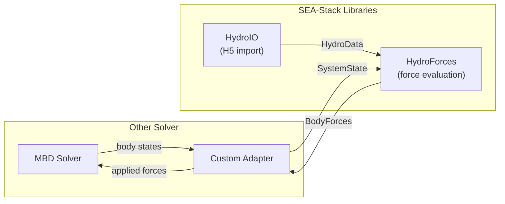

# Extending SEA-Stack

Task-oriented guide for adding new physics, models, and adapters to
SEA-Stack. Each section covers one extension point: the interface to
implement, where to place files, what to link, and how to test.

For the full architecture and module inventory, see
[TECHNICAL_OVERVIEW.md](../../TECHNICAL_OVERVIEW.md).

**Extension points at a glance**

- **Force components** — implement `IHydroForceComponent`
- **Wave models** — subclass `WaveBase`
- **PTO models** — implement `IPTOModel`
- **Controllers** — implement `IController`
- **External force modules** — out-of-process Python/MATLAB (or FMI) via `IExternalForceModel`; see [EXTERNAL_FORCE_MODULES.md](EXTERNAL_FORCE_MODULES.md)
- **Solver adapters** — add an adapter analogous to `adapters/chrono/`

---

## Add a new hydrodynamic force component

**Interface:** `IHydroForceComponent` in
`libs/core/include/seastack/core/force_component.h`

```cpp
namespace seastack::hydro {

class IHydroForceComponent {
  public:
    virtual ~IHydroForceComponent() = default;
    virtual HydroComponentType Type() const = 0;
    virtual void Compute(const SystemState& state,
                         double time,
                         BodyForces& inout_forces) = 0;
};

}  // namespace seastack::hydro
```

**Steps:**

1. Create a header under `libs/hydro/include/seastack/hydro/force_components/`
   and a source file under `libs/hydro/src/force_components/`.

2. Subclass `IHydroForceComponent`. Implement `Type()` (add a value to
   `HydroComponentType` if needed) and `Compute()`.

3. Add the source file to the `SEAStack::Hydro` target in
   `libs/hydro/CMakeLists.txt`.

4. Register the component with the force model. Two options:

   - **Via HydroModelBuilder:** call `.AddComponent(std::make_unique<YourComponent>(...))` on the builder before `.Build()`.
   - **Manual assembly:** construct the component directly and include it in the `std::vector<std::unique_ptr<IHydroForceComponent>>` passed to `HydroForces`.

**Example:** see `DampingComponent` in
`libs/hydro/include/seastack/hydro/force_components/damping_component.h` for
a simple component that reads from `SystemState` and accumulates into
`BodyForces`.

**Testing:** add a unit test under `tests/unit/`. Chrono-free components can
be tested without a solver — construct a `SystemState`, call `Compute()`,
and check the output `BodyForces`.

---

## Add a new PTO model

**Interface:** `IPTOModel` in
`libs/pto/include/seastack/pto/pto_model.h`

```cpp
namespace seastack::pto {

class IPTOModel {
  public:
    virtual ~IPTOModel() = default;
    virtual double ComputeForce(double displacement,
                                double velocity,
                                double time) = 0;
};

}  // namespace seastack::pto
```

**Steps:**

1. Create a header and source file under `libs/pto/include/seastack/pto/` and
   `libs/pto/src/`.

2. Subclass `IPTOModel` and implement `ComputeForce()`.

3. Add the source file to `SEAStack::PTO` in `libs/pto/CMakeLists.txt`.

4. PTO has no dependencies beyond the C++ standard library. Do not introduce
   Eigen, HDF5, or Chrono dependencies.

**Chrono integration:** when running inside Chrono, `PTOForceFunctor` in the
adapter layer wraps any `IPTOModel` and connects it to a `ChLinkTSDA`. No
changes to the adapter are needed for new PTO models.

**Example:** `LinearPTO` in `libs/pto/include/seastack/pto/linear_pto.h`
(spring-damper: `F = -kx - cv`). For a complex example, see
`RectifiedHydraulicPTO` which includes sub-stepping, accumulators, and an
optional controller.

**Testing:** add a unit test under `tests/unit/`. PTO tests are chrono-free
and run in milliseconds.

---

## Add a new controller

**Interface:** `IController` in
`libs/control/include/seastack/control/controller.h`

```cpp
namespace seastack::control {

class IController {
  public:
    virtual ~IController() = default;
    virtual double Compute(double measurement, double time) = 0;
    virtual void Reset() {}
};

}  // namespace seastack::control
```

**Steps:**

1. Create a header under `libs/control/include/seastack/control/`. Control is
   header-only — no source files or `CMakeLists.txt` changes needed unless
   your controller requires a `.cpp`.

2. Subclass `IController`. Implement `Compute()` and optionally `Reset()`.

3. Control has no dependencies beyond the C++ standard library. Keep it that
   way.

**Usage with PTO:** controllers are typically connected to a PTO model (e.g.
`RectifiedHydraulicPTO` accepts an optional `IController*` for motor speed
regulation).

**Example:** `PIController` in
`libs/control/include/seastack/control/pi_controller.h` (proportional-integral
with anti-windup). Also see the `ProportionalController` in
`examples/standalone_controller/main.cpp` for a minimal inline example.

**Testing:** add a unit test under `tests/unit/`. Controller tests are
chrono-free.

---

## Add an external force module (Python / MATLAB)

**Interface:** `IExternalForceModel` in
`libs/external/include/seastack/external/external_force_model.h`

Full protocol, lifecycle, YAML keys, and language helpers are documented in
[EXTERNAL_FORCE_MODULES.md](EXTERNAL_FORCE_MODULES.md).

**Summary:**

1. Implement a user script that speaks the length-prefixed JSON protocol
   (use the shipped `seastack_external` Python or MATLAB helper).
2. Bridge via `ExternalPtoModel` (1-DOF `IPTOModel`) or
   `ExternalForceComponent` (6-DOF hydro component).
3. Enable with `-DSEASTACK_ENABLE_EXTERNAL=ON`.
4. Point `run_seastack` at the script with `external_pto_file:` in the
   setup YAML (details in `*.external_pto.yaml`), or wire in C++ with
   `PTOForceFunctor`.

**Examples (Python, by verification property):** `linear_damper_pto.py`
(transport), `adaptive_damping_pto.py` (stateful PI control) and
`hydraulic_accumulator_pto.py` (dynamic subsystem) under
`data/demos/run_seastack/rm3/external_pto*` (TSDA) and
`data/demos/run_seastack/oswec/external_pto*` (RSDA; same scripts, rotational
config).

**Testing:** a three-level verification ladder (see
`examples/external_pto/README.md`):
- chrono-free unit tests under `tests/unit/test_ipc_external_*` and
  `tests/unit/test_external_pto_model.cpp`;
- prescribed-input golden + hydraulic component checks via
  `examples/external_pto/verify_examples.py` (ctest
  `test_external_pto_examples_golden`);
- IPC transport equivalence via `compare_ipc_replay.py` (ctests
  `test_external_pto_ipc_{linear,adaptive,hydraulic}`);
- a focused Chrono RM3 regression via `verify_rm3_regression.py` (ctest
  `test_external_pto_rm3_regression`) — linear exact-equivalence vs a native
  `LinearPTO` twin, aggregate checks for adaptive/hydraulic.

---

## Add a new solver adapter

**Pattern:** `adapters/chrono/` — the existing Chrono adapter.

The adapter layer bridges a dynamics engine to SEA-Stack's domain libraries.
The key coupling point is `ChronoHydroCoupler`, which:

1. Extracts body states from the solver into `SystemState`
2. Calls `HydroForces::Evaluate(state, time)` to get `BodyForces`
3. Maps forces back into the solver's representation

**Chrono and infinite-frequency added mass:** For **`N`** hydro bodies, let
**`nDoF = 6N`**. The coupled infinite-frequency added-mass matrix is
**`nDoF × nDoF`** (including hydrodynamic **cross-coupling** between bodies).
Project Chrono's **`ChLoadHydrodynamics`** takes **`N`** blocks of shape
**`6 × nDoF`**: each block is one body's six rows against all hydro DOFs (see
`tests/unit/test_added_mass_determinism.cpp`). `HydroSystem`
(`adapters/chrono/src/hydro_system.cpp`) registers those blocks from the per-body
**`inf_added_mass`** arrays read from BEMIO HDF5 (dimensions follow the file:
**`6×(6N)`** when the full coupled strip is stored, **`6×6`** for a self-only
block).

**Data flow** for a non-Chrono multibody solver (aligned with
[TECHNICAL_OVERVIEW.md](../../TECHNICAL_OVERVIEW.md) Appendix F.4.1–F.4.2):



**Steps for a new adapter:**

1. Create a directory `adapters/<solver_name>/` with `include/` and `src/`
   subdirectories.

2. Implement a coupler analogous to `ChronoHydroCoupler`:
   - Extract positions and velocities from your solver's body types into
     `SystemState`
   - Call `HydroForces::Evaluate()`
   - Apply the returned `BodyForces` to your solver

3. **Handle added mass.** The full operator is **`nDoF × nDoF`** with
   **`nDoF = 6N`** for **`N`** hydro bodies (not independent **`6×6`** blocks
   unless cross-coupling is negligible or omitted in the data). **With Chrono**,
   `HydroSystem` wires **`ChLoadHydrodynamics`** as above. **With any other MBD
   package**, SEA-Stack does not provide a generic injector: you must map the same
   **`inf_added_mass`** strips (and any off-diagonal coupling your file format
   encodes) into that solver's mass assembly.

4. Wire PTO forces. Create a functor analogous to `PTOForceFunctor` that
   connects `IPTOModel::ComputeForce()` to your solver's joint/link
   mechanism.

5. Add a CMake target in `adapters/<solver_name>/CMakeLists.txt`. Link
   `SEAStack::Core`, `SEAStack::Hydro`, `SEAStack::PTO`, and your solver.

**Reference:** the Chrono adapter in `adapters/chrono/` is the canonical
example. See `ChronoHydroCoupler` for the **`SystemState` / `BodyForces`**
bridge, `HydroSystem` for **`ChLoadHydrodynamics`** and added mass, and
`PTOForceFunctor` for PTO integration.

See also [TECHNICAL_OVERVIEW.md](../../TECHNICAL_OVERVIEW.md) Appendix F.3
(subsections F.3.1–F.3.4) and F.4 (F.4.1–F.4.3) for Chrono diagrams, the
`run_seastack` lifecycle flowchart, and alternate-solver / light-target patterns.

---

## Add or update tests and demos

### Test taxonomy

| Suite | Label | Purpose | Reference comparison |
|-------|-------|---------|----------------------|
| Unit | `unit` | Library-level checks, mostly chrono-free | None (assertions) |
| Regression | `regression` | Simulation output vs frozen `ss_ref_*.txt` | L2/L-inf norms |
| Verification | `verification` | External/multi-code baselines | `data/verification/` |
| Comparison | `comparison` | Two SEA-Stack configs compared | Python diff |
| Benchmark | `benchmark` | Wall-clock timing | None (JSON output) |

See [`tests/README.md`](../../tests/README.md) for how to run suites and track
overview; for per-case CTest names and advanced runner notes, see
[`tests/TEST_SUITES_REFERENCE.md`](../../tests/TEST_SUITES_REFERENCE.md).

### Adding a unit test

1. Create `tests/unit/test_<name>.cpp`.
2. Use `TEST_ASSERT` / `TEST_NEAR` macros (see existing tests for patterns).
3. Register in `tests/unit/CMakeLists.txt`:

   ```cmake
   add_executable(test_my_feature test_my_feature.cpp)
   target_link_libraries(test_my_feature PRIVATE SEAStack::Hydro)  # or appropriate target
   add_test(NAME test_unit_my_feature COMMAND test_my_feature)
   set_tests_properties(test_unit_my_feature PROPERTIES LABELS "unit;chrono-free")
   ```

### Adding a regression test

1. Create the simulation executable under `tests/regression/<family>/`.
2. Run once to produce output, review it, and commit the reference file as
   `ss_ref_<case>.txt`.
3. Register the CTest run step and a Python comparison step. Use the naming
   functions from `cmake/SeaStackTestNaming.cmake`:

   ```cmake
   include(SeaStackTestNaming)
   seastack_ctest_name(regression sphere my_case RUN run_name)
   seastack_ctest_name(regression sphere my_case REFERENCE ref_name)
   ```

4. Reference data (`ss_ref_*.txt`) is **never regenerated** — it is the
   frozen ground truth. If physics change, update the reference deliberately.

### Adding a demo case

YAML-driven demo cases go under `data/demos/run_seastack/<model>/`. Each
case directory contains a simulation YAML, model YAML, and hydro config.
See [data/demos/run_seastack/README.md](../../data/demos/run_seastack/README.md)
for the catalog and file conventions.

---

## General guidelines

- **Preserve existing APIs** unless explicitly extending them.
- **Prefer simple, readable code** over heavy abstractions or templates.
- **Document units and sign conventions** in new headers.
- **All existing regression tests must pass** after your changes.
- Follow the [Google C++ Style Guide](https://google.github.io/styleguide/cppguide.html)
  and the conventions in [CONTRIBUTING.md](../../CONTRIBUTING.md).
